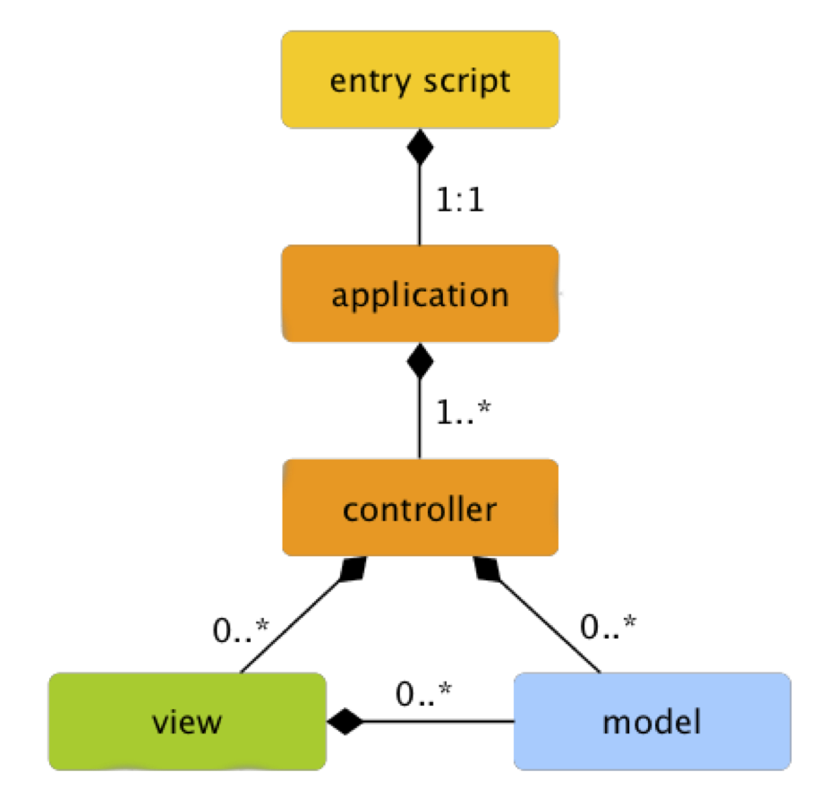
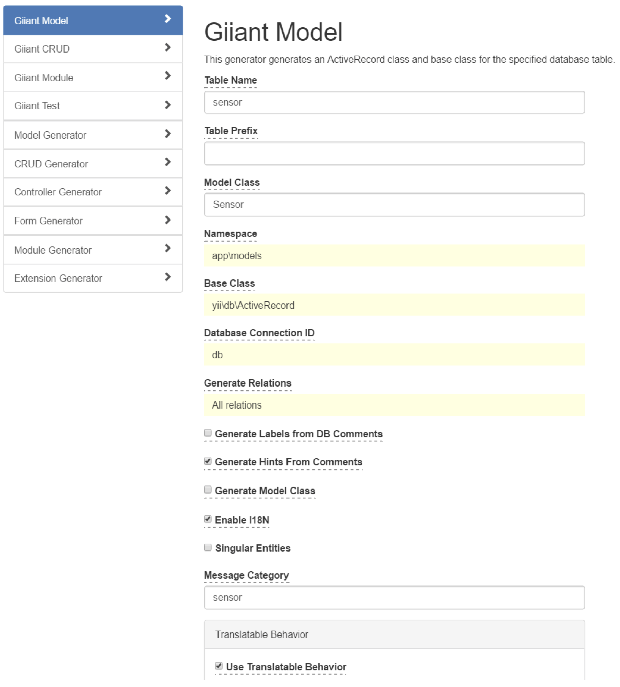
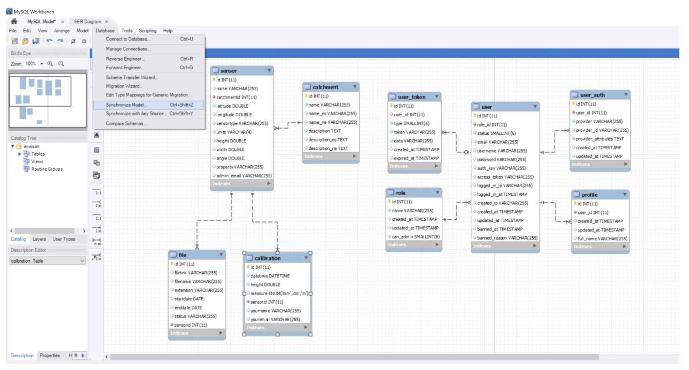
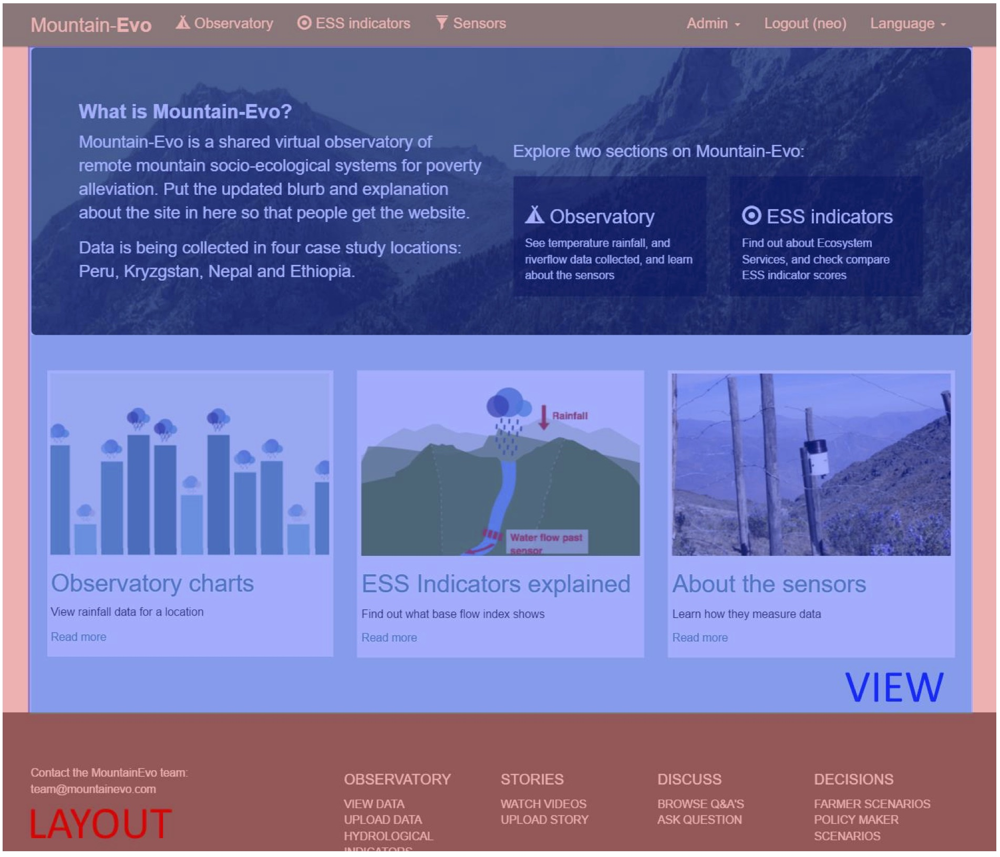
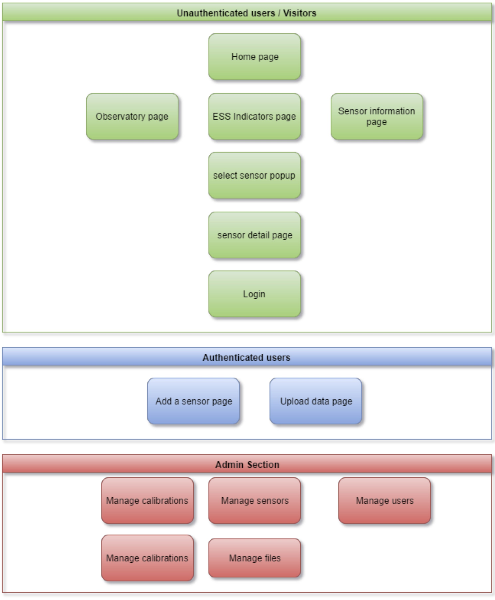

# Developer guide

## 1. Yii2

We use the Yii2, which is a component-based PHP framework for rapidly developing modern Web applications. The name YII can be considered as the acronym for Yes It Is! Yii2 inherits the main spirit behind YII for being a simple, fast and highly extensible PHP framework. Some advantages include:

* Yii2 is a generic Web programming framework
* Yii2 can be used for developing all kinds of Web applications based on PHP
* Yii2 is component-based architecture and sophisticated caching support
* Yii2 is especially suitable for developing large-scale applications. such as portals, forums, content management systems (CMS), e-commerce projects, RESTful Web services, and so on
* Yii2 implements the MVC (Model-View-Controller) design pattern
* Yii2 has a Strong core developer team
* Forum support is available on Yii2 sites

### An Introduction to MVC

MVC stands for Model View Controller. Model view controller (MVC) is a very useful and popular design pattern.
In a typical application you will find these three fundamental parts:

* Data (Model)
* An interface to view and modify the data (View)
* Operations that can be performed on the data (Controller)

The MVC pattern, in a nutshell, is this:

* The model represents the data, and does nothing else. The model does NOT depend on the controller or the view.
* The view displays the model data, and sends user actions (e.g. button clicks) to the controller.
* The controller provides model data to the view and interprets user actions. The controller depends on the view and the model.

### Configuration

Configuration of Yii2 is done in the config directory.

* web.php: contains the application components and configuration
* db.php: contains the database specific configuration
* i18n.php: contains the language specific configuration
* params.php: contains the application global parameters
* console.php: contains the parameters for the application to be run in a console. Not being used for this project.

You can e.g. change the password for the database connection in the config/db.php file:
```
return [
    'class' => 'yii\db\Connection',
    'dsn' => 'mysql:host=localhost;dbname=anaconda', 'username' => 'myuser',
    'password' => 'mypassword',
    'charset' => 'utf8',
];
```

## 2. Application architecture

Yii applications are organized according to the model-view-controller (MVC) architectural pattern.

A request to the application starts with the entry script: web/index.php. All requests pass via this file. It is responsible for starting every request handling cycle. Inside this file, you can setup select if the application is in a development of production environment.

Models represent data, business logic and rules; views are output representation of models (the pages that you can view); The controllers is called by a request, load the information from the models and generates a new view (web page).



Besides MVC, Yii applications also have the following entities:

* application components: they are objects registered with applications and provide various services for fulfilling requests.
* modules: they are self-contained packages that contain complete MVC by themselves. An application can be organized in terms of multiple modules.
* filters: they represent code that need to be invoked before and after the actual handling of each request by controllers.
* widgets: they are objects that can be embedded in views. They may contain controller logic and can be reused in different views.

More details about the whole Yii2 architecture and more information about the specific entities can be found in the [Yii2 architecture guide](http://www.yiiframework.com/doc-2.0/guide-structure-overview.html).

Only the /web directory is accessible for visitors. In this directory, you have the core index.php, the JavaScript files, CSS files, images etc..

Models are part of the MVC architecture. They are objects representing business data, rules and logic.

## 3. Models

### Different Model Classes

#### Base Model Class

You can create model classes by extending yii\base\Model or its child classes. More information in the [Yii2 Guide](http://www.yiiframework.com/doc-2.0/guide-structure-models.html). The base class yii\base\Model supports many useful features:

Attributes: represent the business data and can be accessed like normal object properties or array elements;

```
$sensor->name = 'Sensor 1';
echo $model->name;
```

Attribute labels: specify the display labels for attributes; By default, attribute labels are automatically generated from attribute names, but you can override these in the attributeLabels method.

```
echo $model->getAttributeLabel('name_es');
>> Name (Spanish)
```

**Massive assignment:** supports populating multiple attributes in a single step; This e.g. makes it easy to load a model after an input form for this model.

**Validation rules:** ensures input data based on the declared validation rules, e.g. is a text field is a number, an email address, not too long, if the textfield is required, etc...

```
public function rules(){
    return [ 
        [['name', 'description'], 'required'],
        ['email', 'email'],
    ];
}
```
**Data Exporting:** allows model data to be exported in terms of arrays with customizable formats.

```
$array = $sensor->attributes;
```

#### Active Record Class

Active Record provides an object-oriented interface for accessing and manipulating data stored in databases. An Active Record class is associated with a database table, an Active Record instance corresponds to a row of that table, and an attribute of an Active Record instance represents the value of a particular column in that row.

Instead of writing raw SQL statements, you would access Active Record attributes and call Active Record methods to access and manipulate the data stored in database tables.

```
$sensor = new Sensor();
$customer->name = 'Sensor 123';
$sensor->save();
```

### GII

As most of the information for the models can be derived from the Database model, Yii2 provides a special method to generate the code for the model classes from the database.
GII is accessible from the url:

```
http://hostname/mountain-evo/web/gii/
```

We are using the giant extension of GII, as it has some benefits over the normal GII.



Giiant Model generates a base class and a model Class. The model Class contains all business logic, written by you. The base class contains all computer generated code, no programmer code. The reason for having these two classes is that, if you need to make a modification to the database (e.g. adding a new field in the database), you only have to generate a new base Class, and your business logic is not being touched or overwritten by the code generation.

### MySQL Workbench
 
MySQL Workbench offers you a visual interface for working with your database model. As explained before, you can synchronize your model with the database to forward engineer changes in your Workbench model to the database model in your MySQL database.



By combining Workbench and GII, you create a combination to easily make modifications and export them to the application:

* Make modifications in the Workbench visual EER diagram.
* Synchronize the model with your database, to make the changes in the MySQL database.
* Regenerate the Base Class for the models involved to adapt the PHP model classes.

## Current Database Tables

**Catchment:** Contains the different Catchment area’s.

**Sensor:** List all the sensors.

**Calibraton:** List all the calibrations for a specific sensor.

**File:** List all the files with calibrations for a specific sensor.

**User, User-token, role, profile, user_auth:** tables related to user authentication and user rights.


## 4. Controller

Controllers are part of the MVC architecture. They are objects of classes extending from yii\base\Controller and are responsible for processing requests and generating responses. In particular, after taking over the control from applications, controllers will analyze incoming request data, pass them to models, inject model results into views, and finally generate outgoing responses.

###Controllers & Actions

Controllers are composed of actions which are the most basic units that end users can address and request for execution. A controller can have one or multiple actions. Controllers can be found in the controller directory.

e.g. /mountain-evo/site/index is generated by the SiteController, action Index

```
class SiteController extends Controller{

    public function actionIndex(){
        return $this->render('index');
    }

}
```

You can pass a parameter via the method variables:

e.g. /mountain-evo/site/sensor?id=5 is generated by

```
public function actionSensor($id){
    echo $id;
}
```

More information can be found in the Yii2 [Controller Guide](http://www.yiiframework.com/doc-2.0/guide-structure-controllers.html).

### Calling the view

The action also determines which view to open. The view is the basis for the final html page. In this case, the view observatory.php will be used:

```
public function actionIndex(){
    return $this->render('observatory');
}
```
You can also pass parameters to the view, where they can be used:

```
public function actionSensor(){
    $sensor_id_var = 5;
    return $this->render('sensor', [‘sensor_id’ => $sensor_id_var]);
}
```

In the view, you can now access the $sensor_id parameter with $this->sensor_id


### Loading Models

Models can be called in several ways.

#### Direct with an SQL query

```
$sensors = Yii::$app->db->createCommand('SELECT * FROM sensor')->queryAll();
```

#### With the Query builder

```
$rows = (new \yii\db\Query())
    ->select(['id', 'email'])
    ->from('user')
    ->where(['last_name' => 'Smith'])
    ->limit(10)
    ->all();
```

More information about the Query Builder can be found on the [Yii2 Query Builder Guide Page](http://www.yiiframework.com/doc-2.0/guide-db-query-builder.html). 

#### With Active Record

This is the preferred way to open models, as it is the cleanest and the easiest method.

```
$sensor = Sensor::find()
    ->where(['id' => 123])
    ->one();
```

More information about active Record can be found on the [Yii2 Active Record Guide Page](http://www.yiiframework.com/doc-2.0/guide-db-active-record.html).

## 5. Views

Views are part of the MVC architecture. They are code responsible for presenting data to end users. In a Web application, views are usually created in terms of view templates which are PHP script files containing mainly HTML code and presentational PHP code. They are managed by the view application component which provides commonly used methods to facilitate view composition and rendering.

### Layout

Layouts are a special type of views that represent the common parts of multiple views. For example, the pages for most Web applications share the same page header and footer. While you can repeat the same page header and footer in every view, a better way is to do this once in a layout and embed the rendering result of a content view at an appropriate place in the layout.
The main layout can be found in the directory: views/layout/main.php. It contains the header, footer and the menu. The code
```
<?= $content ?>
```

is replaced with the specific view.



Homepage: Layout in red, view in blue

### Parameters

The variable $this in the view, refers to the view itself.
If you have passed parameters in the controller to the view, you can access them with

```
$this->sensor_id
$this->sensor->name;
```

### JavaScript, CSS & images.

#### Images

Images are stored in the /web/images directory.

To generate the URL for an image, you can use the web parameter:

```
/images/photos/pluviometer.png' />
```

#### CSS

CSS files are stored in the web/css directory.

If you want to add a CSS file for all pages, you should add it in the layout file: /view/layout/main.php. If you want to add css only on one page, you can add it in the view file directly.

```
$baseUrl = Yii::app()->baseUrl;
$this->registerCssFile($baseUrl.'/css/yourcss.css');
```

Or include the css directly:
```
$this->registerCss("body { background: #f00; }");
```

#### Javascript
JavaScript files should be stored in the /web/js directory.

```
$baseUrl = Yii::app()->baseUrl;
$this->registerJsFile($baseUrl.'/js/yourjs.js');
```

It is also possible to include the position of the JavaScript link in the HTML file

```
$this->registerJsFile($baseUrl.'/js/yourjs.js', View::POS_END);
```

More information can be found on in the [Yii2 guide, working with client scripts](http://www.yiiframework.com/doc-2.0/guide-output-client-scripts.html).

## VI. Translation

A Yii application uses two kinds of languages: source language and target language.

The former refers to the language in which the text messages in the source code are written, while the latter is the language that should be used to display content to end users. The translation translates a text message from source language to target language.

The source language is English, while the target languages are English, Spanish and Nepali.

### Translation Service

Static text in the Yii2 application is handled by the I18N component of Yii2.

Internationalization (I18N) refers to the process of designing a software application so that it can be adapted to various languages and regions without engineering changes. For Web applications, this is of particular importance because the potential users may be worldwide. Yii offers a full spectrum of I18N features that support message translation, view translation, date and number formatting.

#### Translations

A text that needs to be translated, should be coded as follows:

```
echo \Yii::t('menu', 'Observatory');
```

The first parameter, menu, refers to the name of the category which is used to categorize the message.

The second parameter is the original text to be translated. When no translation is available, this text will be shown.

#### Manage the translations

Yii offers a mechanism that automatically goes through all files, collects all translations in all files. Open a prompt and go to the home directory of the project. Then execute:

```
./yii message/extract @app/config/i18n.php
```

If you look then in your /messages directory, you can find a directory for each language. Inside them, there is a file for each category. All translations for that category are listed in these files.
Existing translations are not overwritten by this process.
More information about the translation process can be found on [Yii i18n guide page](http://www.yiiframework.com/doc-2.0/guide-tutorial-i18n.html)
.

## VII. User Access

### User Extention

This project uses the [yii2-user extension](https://github.com/amnah/yii2-user).

It allows a user to login and assigns a role to the user. There are three roles: visitor, normal user, administrator. The admin can login to the user section, create new users and assign a role to them.

### Access control filter

Authorization is the process of verifying that a user has enough permission to do something. Yii provides standard the authorization method: Access Control Filter (ACF). This adds a permission check to every controller. This makes sure that an action is only executed if the ACF allows it.

In the site controller, the rights are based on the role and are defined in the behaviours function. Here, only the authenticated users (defined by @) have access to the addsensor and uploaddata actions.

```
public function behaviors(){
  return [
    'access' => [
      'class' => AccessControl::className(),
      'only' => ['addsensor', 'uploaddata'],
      'rules' => [
        [
          'actions' => ['addsensor', 'uploaddata'], 'allow' => true,
          'roles' => ['@'],
        ],
      ],
    ],
  ];
}
```

The other controller allow only the admin to access the functionality:

```
'roles' => ['admin'],
```

More information about the Access control filter can be found on the [Yii Authorization guide page](http://www.yiiframework.com/doc-2.0/guide-security-authorization.html).

#### Role check

In the code, you can check the role of the user with the following code: Check if the user is not authenticated (a guest visitor):

```
If (Yii::$app->user->isGuest){

}
```
Check if the user is an admin:

```
if Yii::$app->user->can("admin")
```

### Current site overview



